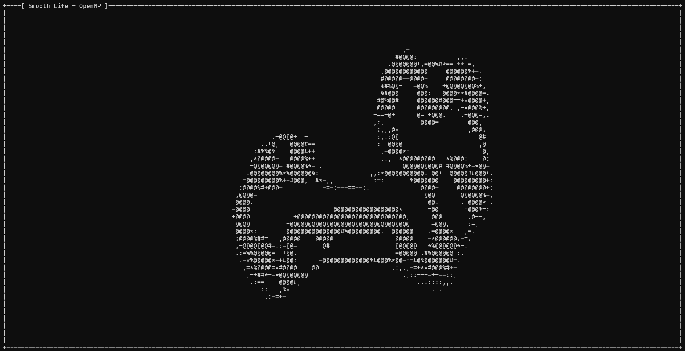
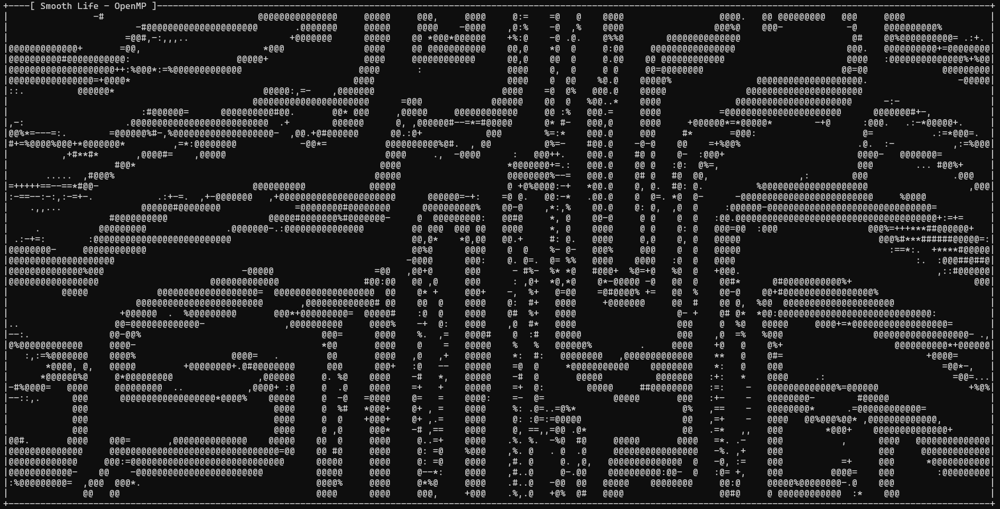
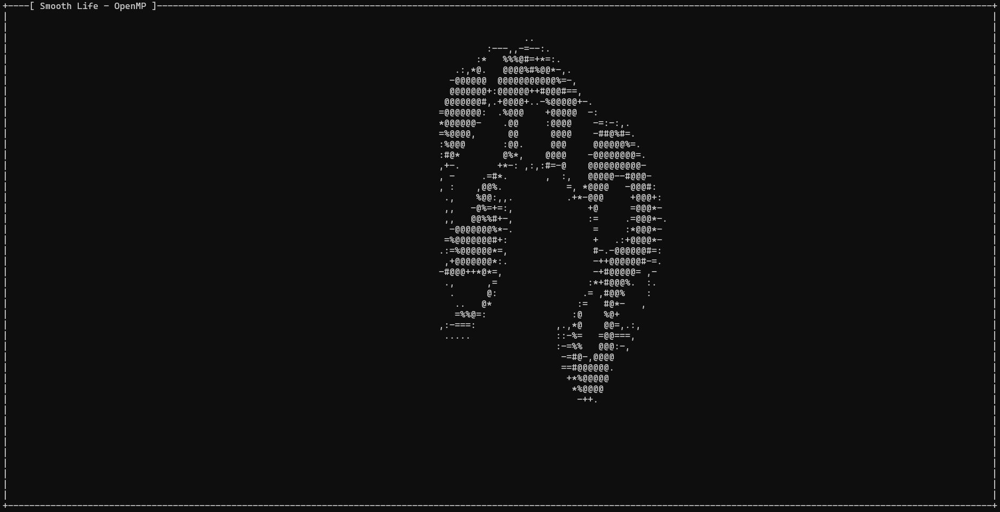

# smooth_life
smooth_life is a cli implementation of a generalized version of Conway's "Game of Life" explained in a paper authored by [Stephan Rafler](https://arxiv.org/pdf/1111.1567.pdf).

## Gallery




## Requirements
The project utilizes `Make` as the designated build system, `gcc 9.4` for compilation, and incorporates the subsequent dependencies.

- `libncurses5-dev`
- `pthreads`    (bundled with gcc)
- `OpenMP`  (bundled with gcc)
- [`tomlc99`](https://github.com/cktan/tomlc99) (included as a git submodule)

### Using Docker
An alternative to installing all the dependencies is to use [Docker](https://www.docker.com) and create an image using the [`Dockerfile`](./Dockerfile) provided.

Then you can run smooth_life with the following command:
```bash
docker run -it <name_of_your_image> <optinal: your_config_file>
```

## Usage

To compile the project, simply run `make` or, for a debug build, `make debug=true`.

smooth_life can be executed using either the default configuration or a custom configuration.
```bash
# Default configuration
./smooth_life
# Custom configuration
./smooth_lide config.toml
```

The example file [`config.toml`](config.toml) contains a comprehensive list of all configurable values.

### In the simulation
During the execution of smooth_life, the `r` key triggers a simulation restart, while the `q` key terminates the program.
